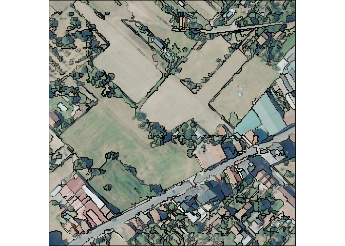

# OTBsegm

**OTBsegm** is an R package that provides a user-friendly interface to
the unsupervised image segmentation algorithms available in [Orfeo
ToolBox (OTB)](https://www.orfeo-toolbox.org/), a powerful open-source
library for remote sensing image processing. **OTBsegm** is built on top
of [`link2GI`](https://r-spatial.github.io/link2GI/) R package,
providing easy access to image segmentation algorithms.

To use {`OTBsegm`}, you must first install OTB on your machine. Once OTB
is installed and properly linked through {`link2GI`} (see examples),
this package allows you to easily integrate OTB’s segmentation
algorithms into your workflows.

## Installation

You can install the development version of OTBsegm from
[GitHub](https://github.com/) with:

``` r
# install.packages("pak")
pak::pak("Cidree/OTBsegm")
```

## Example

We will see how to segment an image included in the package:

``` r
## load packages
library(link2GI)
library(OTBsegm)
library(terra)
#> terra 1.8.50

## load image
image_sr <- rast(system.file("raster/pnoa.tiff", package = "OTBsegm"))

## visualize
plotRGB(image_sr)
```


The image is a 500x500 meters RGB tile, with a spatial resolution of 15
cm in Galicia, Spain. The meanshift algorithm has the next important
arguments:

- **spatialr**: spatial radius of the neighborhood

- **ranger**: range radius defining the radius (expressed in radiometry
  unit) in the multispectral space

- **minsize**: minimum size of a region (in pixel unit) in segmentation.
  Smaller clusters will be merged to the neighboring cluster with the
  closest radiometry. If set to 0 no pruning is done. The image’s
  resolution is 1.2 m, therefore, a value of `minsize = 10` means that
  the smallest segment will be $10*1.2^{2} = 14.4m^{2}$.

In order to use the algorithms, we need to link our OTB installation
using {`link2GI`}:

``` r
otblink <- link2GI::linkOTB(searchLocation = "C:/OTB/")
```

Once we are connected, we can apply the segmentation algorithm and
visualize the results:

``` r
results_ms_sf <- segm_meanshift(
    image    = image_sr,
    otb      = otblink,
    spatialr = 5,
    ranger   = 25,
    maxiter  = 10,
    minsize  = 10
)
#> Reading layer `file7054158ad50' from data source 
#>   `C:\Users\User\AppData\Local\Temp\Rtmp8O6UBy\file7054158ad50.shp' 
#>   using driver `ESRI Shapefile'
#> Simple feature collection with 811 features and 1 field
#> Geometry type: POLYGON
#> Dimension:     XY
#> Bounding box:  xmin: 621000 ymin: 4708385 xmax: 621300 ymax: 4708685
#> Projected CRS: ETRS89 / UTM zone 29N
```

``` r
plotRGB(image_sr)
plot(sf::st_geometry(results_ms_sf), add = TRUE)
```


